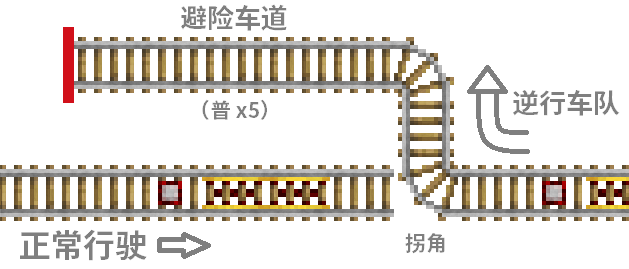
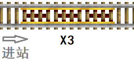
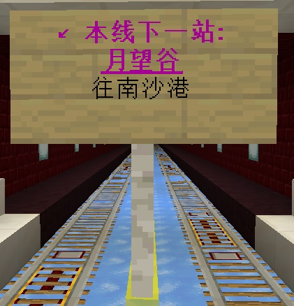

# 轨道工程建设标准与规范

!> **请注意：本页面不再更新，将来或被移除。**  
新建线路请参考[铁路工程](nyaa/projects/railway#secondary)的二级铁路推荐规范——本页仅为对2019年以前现有线路之总结。我们在传承之余，更应有所创新。

喵窝铁路工程延续数年，截至2019年7月，地面大部分路段皆已通车达三年以上；下界交通网大部业已通车逾二年。由于一直未达成建设规范共识，不同建设者在不同时期各行一套标准，致使多种标准并存；其中有的设计不甚人性化，相当影响用户乘坐体验。

*小爱 `Bersella_AI`*凭借多年实践经验，以及全服前三的总行驶里程，在原“南方铁路集团”等前辈之基础上，提出全新建设规范与标准。

## 零、缩略词约定
- 【金】：加速铁轨
- 【普】：普通铁轨
- 【探】：探测铁轨
- 【激】：激活铁轨
- 【普】x8：普通铁轨8格
  + 其余以此类推。

## 一、地面公共铁路部分
### 1.1 线路与轨道规范
#### 1.1.1 线路轨道通则
1. 所有线路一律实施双向通行，左侧前行；有2条或4条轨道，每个方向占1~2条。
1. 线路两边须屏蔽，阻止除玩家外一切地面生物侵入。如果线路在海平面（Y=63）以下，须做好防水工作。
1. 单向轨道要阻止至少一辆车的逆行。
1. 一级干线、环线标准强制执行；二级铁路除上述三条外，可自由定制。

#### 1.1.2 一级干线标准
- **定义：**自樱华町直达其余各大城市的线路。
- **轨道平面高度：**一般锁定于Y=80。
- **轨道组成：**四轨，每11米铺设【探】x1→【金】x2→【普】x8。  

- **照明：**中央铺灯带，两向轨道中间立路灯（与加速铁轨平齐）。
- 高架桥每66米设一座桥墩。

#### 1.1.3 一级环线标准
- **定义：**各大城市（除樱华町）之间连接的，环绕樱华町的类矩形线路。
- **轨道平面高度：**一般锁定于Y=80。
- **轨道组成：**双轨，每21米铺设【探】x1→【金】x2→【普】x18。
- **照明：**中央铺荧石或海晶灯带。
- 高架桥每42米设一座桥墩。

#### 1.1.4 二级铁路规范（非强制）
- **定义：**除一级干线、环线外的所有向公众开放的线路。
- **轨道组成：**一般为双轨。
  + 遇地形限制仅允许单轨的，可做单轨双向，而一旦离开该地形，需尽快恢复双轨。
  + **通用铺设方案：**
    * 平地**每11米铺设【探】x1→【金】x2→【普】x8**（同一级干线）。
    * 上坡路段，一概铺设【金】并通电。
    * 下坡可沿用平地样式，亦可仅铺设【普】以节约金锭开销。
  + **备用铺设方案：**
    * ① 每11米铺设【探】x1→【金】x3→【普】x7。
    * ②*琥珀川——不莱梅段：*每21米铺设【探】x1→【金】x1→【普】x6→【探】x1→【金】x6→【普】x6。  
    
    * ③*新北市/千里田周边：*每4\~6米铺设【探】x1→【金】x2→【普】x1\~3。
    * ④*新北市周边：*每8\~9米铺设【探】x1→【金】x2→【探】x1→【金】x2→【普】x3\~4。
    * ⑤*南城地铁/馥雅周边：*每23米铺设【探】x1→【金】x2→【普】x20。

?> :heavy_check_mark: **应尽量采用“通用方案”，以确保行车体验；**并建议配置逆行避险车道（见下）。  
“备用方案”仅当在维护当地线路时，用于参考。

- 当需要拦截两辆及以上并排的逆行车队时，可修筑**逆行避险车道：**  
    
  在开阔地带每隔100\~200米，或靠近站点入口处、上坡起点/下坡终点处，于侧边修筑【普】x5\~7，作为避险车道；将主路上某个【普】逆向引出，接入避险车道。  

!> 【探】不得接触图中的拐角。  
为防止幻翼袭击，应于避险区搭建**不透明**简易雨棚。

- **照明：**自由定制，以防止线路内部生成怪物为准。以下方案可供参考。
  + **户外方案①：**两边每7~11米设置路灯。
  + **户外方案②：**中央每8~13米设置路灯。
  + **户外方案③（电线杆）：**中央每7~11米立T形“电线杆”，高、宽5米，于T形两边下方摆放末地烛或灯笼。
    * T下方可附加“电线”（铁栏杆，与轨道平行）。
  + **隧道内方案：**在宽5米的隧道，两边每6米设置路灯。
- 两条轨道需要汇合的，其中一方拐弯，另一方直线铺向该拐角。
- 两条轨道需要在同一平面交叉穿过的，先铺设出口，使两个方向汇合、产生一个拐弯；再铺设入口，通向该拐角。
  + 仅允许单向通过拐角。
  + 【探】不可接触该拐角。
- 在斜向路段，紧靠轨道的方块（一般用于屏蔽）应尽可能纤细，最粗不超过石墙，以减少对车速的影响。
  + 栅栏、铁栏杆、玻璃板等皆可接受。
  + 若必须在此路段使用水平全尺寸方块（如台阶）屏蔽，请避免使其紧挨轨道。
- 桥梁应有合理支撑。
- 其余方面不作要求。


### 1.2 站台规范
#### 1.2.1 站台通则
+ 作为站台，**最基本的要素**有：停车带及落脚点，加速带，站牌（指向牌），出入通道。
  - **停车带：**由【金】x3组成，一般不通电。可在紧邻停车带最前一格铁轨的方块之上，安装按钮，以便再出发。  
  
  - **加速带：**在停车带前方，铺设【普】x1→【探】x1→【金】x1→【普】x1→【探】x1→【金】x2。    
  若前方需立即转弯，可酌情简化之。  
  
  - **站牌：**见1.3节。
  - **出入通道：**必须通往明显的人造结构，或具特殊意义的自然结构（例如要塞、海底神殿）。
+ **可选要素**有：自动化收车/发车装置，载具储存箱，配套站楼。
  - 收发车装置标准见1.4节。
  - 即便没有站楼，为了看上去更像个站点，也要尽量加些醒目的装饰。

#### 1.2.2 一般中途站点规范
同1.2.1节。

#### 1.2.3 首末站规范
- 入站方向，不设加速带，避免车辆自发逆行。终点处设障拦截，或安装收车装置。
  + 有收车装置的，不设停车带。装置规范见1.4节。
- 出站方向，起点处至站台边缘，应适当设置加速带，以便自带矿车的乘客出发。
- 其余循1.2.1节。

#### 1.2.4 换乘站规范
**对于手动换乘的：**

- 有三个方向的，连通其中两个，循1.2.1节；第三个方向按首末站规范处理。
- 有四个方向的，分为两对；每对分别连通、设置站台。
- 站台间换乘通道不宜过长；换乘方向要明确标出。

**对于自动化换乘的：**

- **仿首末站方案：**每个方向单独设置自动化收车/发车装置。
- **电气化方案：**进站后，在下坡处停车选择方向，以电路控制道闸，一键离开。
  + 此方案仅建议部署于有三个方向，且不考虑上下车的换乘站。
  + 强烈建议配备站楼，以隐藏电路。否则，可能不美观。
- **东海望方案：**进站自动下车，出站后选择目的地，再出发。
  + 必须配备复杂红石电路（用于变道）及站楼（隐藏电路）。

### 1.3 站牌规范
- 在站台，每方向设置至少一块，分别面向该方向的停车带。
  + 如果一块不够用，可再设置一块。
  + 无停车带的，设于轨道终点处。
- 南北向牌子建议使用**白桦木牌**；字体颜色以暗色系（&0~&7）、蓝色（&9）、红色（&c）与粉色（&d）为主。
  + 深色橡木牌亦可（颜色见下）。
- 东西向牌子建议使用**深色橡木牌**；字体颜色推荐亮色系（&8~&f）、橙色（&6）。
- 内容有 **本站名称、下一站**（如果有）、下一站可抵方向（如果有；不含本站）、本站换乘方向（如果有）、“终点站”（如果是）。
  + 本站及下一站名称应优先着重标示。换乘方向次之。
  + 如果下一站为首末站，应将其与本站名称居中标示。
  + 如果本站为首末站，则**不必**在标示“下一站”的牌子写进本站名称。


#### 示例
|位置|示例图|相应命令|
|-|-|-|
| 南北向的起点站 |  | ``` /nu se sign 0 `&5&l↙ 本线下一站：` ``` <br />`/nu se sign 1 &5&l&n月望谷` <br />`/nu se sign 2 往南沙港` |
| 东西向的换乘站 |  | ``` /nu se sign 0 `&3&l&n本站： 柚木小镇` ``` <br />``` /nu se sign 1 `&b&l下一站： &b&l&n红魔城` ``` <br />``` /nu se sign 2 &b往科技特区 ``` <br />```/nu se sign 3 `&f&l<<< 月望谷，南沙港` ``` |

?> :information_source: 执行命令前，主手持**无NBT标签的**告示牌。

### 1.4 自动化收/发车装置标准
- **基本形态：**如图，
  + 起点处铺设【金】x3；
  + 安装一台发射器，紧邻并面向第一格铁轨；
  + 发射器上或旁边，安装按钮，使其弹出矿车，并同时激活【金】。
  + 终点处前方种植一株仙人掌（并限制其成长）；前下方设置漏斗以收集矿车，串联若干漏斗后，输入发射器。  
  如未安装配件②，乘客在矿车弹出后须迅速上车，否则车将溜走，体验相对不佳。
- **可选配件①：**临近终点处，设置【探】x1→【激】x1，将乘客提前弹出。  
  此法可令乘客在预想地点下车，然后将矿车引至他处回收。
- **可选配件②：**自动出车机
  + 起点处改为铺设【金】x10→【普】x1→【探】x1；
  + 于起始第1格铁轨上放置绊线；
  + 于第2、第10格铁轨下插红石火把；
  + 【探】下方则引电线，同时输入两个红石火把。矿车经过时，其将同时熄灭、恢复。  
  + 启用时，需令矿车经过【探】。此后若矿车未耗尽，则起点处永远停放一辆车，玩家可直接上车出发。
  + 然而，按钮仍是必需的，以便无车时尝试弹出矿车。按钮需摆在发射器旁，恰好可触发发射器、不会激活首个铁轨。


## 二、下界交通网部分
!> 本部分仅约束以下界(0, 5, 49)为中心的交通网，以确保风格一致。  
在该交通网以外建设的轨道工程，不受此制约。

### 2.1 线路与轨道建设标准
1. 在Y坐标5~11（含）之间，挖掘宽9米的隧道；
2. 最外层填充一层黑曜石；
3. 内填**红色地狱砖墙面，与蓝冰路面**。路面处于中央，宽3米。
  + 其中，天花板用**地狱砖台阶**，两侧则以**红色地狱砖楼梯**支撑之。
4. 路面中央以有色（一般为主城四色）玻璃板隔离；两侧铺设红色地狱砖台阶（下半部），高出路面半米。
5. 路面上方铺设两条双向通行的铁轨。  
  每13米铺设【探】x1→【金】x3→【探】x1→【普】x8。
6. 墙面每5米嵌入一盏海晶灯，高度为Y=8。
7. 拐角尽可能少。**拐角处按站台标准建设**，但不停车；并设置显著导向箭头（推荐品红色带釉陶瓦）。
  在设计新线路时，应优先接入主干道沿线站点；中线须对齐始发站点之中心。

### 2.2 站台标准
#### 2.2.1 一般建设标准
1. 在Y坐标5~12（含）之间，挖掘水平17x17空间，中线须对齐入站线路；  
  *（例外：樱华町站）*
2. 最外层填充一层黑曜石；
3. 内填石英块及其加工品，余下空间高度达3~4.5米；
4. 设置若干海晶灯，沿站台中心对称摆放，并使地面任何一处亮度不小于8；
5. 建议将传送门直接设置于站台内。若不便如此做，则挖掘垂直通道（最好在站台一侧），连接二者。
6. 每个站点最多通往4个方向。

#### 2.2.2 冰道接入标准
- **中途站点：**
  + 设7米长的停船带，位于站台中央。
  + 将冰道延长至停船带两端。
  + 以石英台阶（下半部）或毛毯限制船的活动范围；边缘尽量连续，避免瞬间停船。
- **首末站：**将冰道延长至距离站台中心3~4米处。
- **换乘站：**
  + 有三个方向的，两向直线连通，按中途站点处理；第三个方向与其垂直交汇于站台中心，按首末站处理。
  + 有四个方向的（除樱华町站外），两两连通，交汇于站台中心，均按中途站点处理。

#### 2.2.3 铁轨接入标准
- 停车带仍为3米，位于停船带内。
- 在中途站点，将按钮置于紧邻停车带最前一格铁轨的方块之上（该方块不得置于中央）；
- 首末站不设收/发车装置；将按钮置于起点处。
- 其余遵循1.2节。

### 2.3 站牌规范
同1.3节。

- - -
## Changelog {docsify-ignore}
2019年5月19日 初稿  
7月25日 第一次修改  
8月4日 第二次修改  
2020年2月14日 第三次修订  
2021年4月12日 标记为“过时”